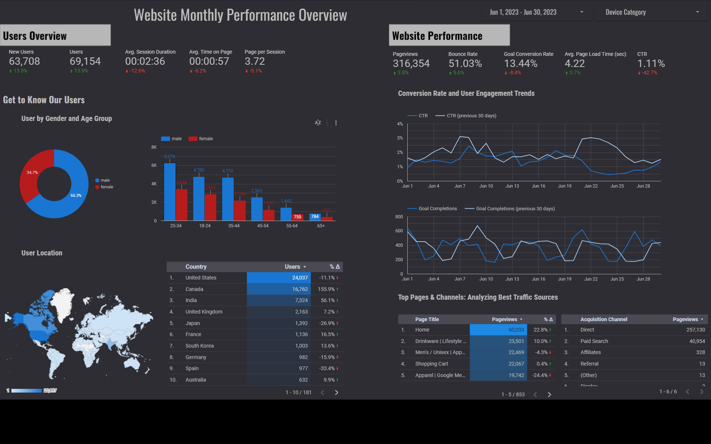

# Monthly-Web-Performance-Dashboard
Monthly Web Performance Dashboard: A data visualization project to track and monitor web performance metrics on a monthly basis. Gain valuable insights into website performance trends with this interactive dashboard.
<h2>Overview:</h2>

The dashboard I designed and developed provides a comprehensive view of monthly
website performance, featuring key indicators crucial for monitoring and evaluation
purposes. It offers valuable insights into various aspects of user engagement and
website effectiveness, aiding data-driven decision-making.

<h2>Objectives:</h2>

The primary objective of this dashboard is to enable stakeholders to assess website
performance and user behavior, allowing them to identify strengths, weaknesses, and
opportunities for improvement. By presenting essential metrics, such as new users, total
users, average session duration, average time on page, and pages per session, it
empowers stakeholders to gauge user engagement and website popularity effectively.

<h2>Data Source:</h2>

The data used in this dashboard is derived from Looker.

<h2>Tools:</h2>

Looker Studio.

<h2>Metrics:</h2>
<ol>
  <li>New Users: The total number of new users who visited the website during the specified time period. This metric provides insights into the website's ability to attract and engage new visitors.</li>
  <li>Total Users: The overall count of unique users who accessed the website within the reporting period. This metric gives a snapshot of the website's total reach and popularity among users.</li>
  <li>Average Session Duration: The average time users spend on the website per session. This metric indicates user engagement and how compelling the content is to keep users on the site.</li>
  <li>Average Time on Page: The average time users spend on a specific page during their visit. This metric helps identify pages that capture users' attention and areas where content may need improvement.</li>
  <li>Pages per Session: The average number of pages viewed by users during a single visit. This metric measures user engagement and the effectiveness of website navigation.</li>
  <li>Pageviews: The total number of pages viewed by all users during the specified period. This metric indicates overall website traffic and the popularity of different pages.</li>
  <li>Bounce Rate: The percentage of single-page visits where users leave the website without further interaction. A lower bounce rate suggests higher user engagement.</li>
  <li>Goal Conversion Rate: The percentage of users who completed specific goals or actions, such as filling out a form or making a purchase. This metric reflects the website's effectiveness in driving desired user actions.</li>
  <li>Average Page Load Time: The average time it takes for a page to fully load. This metric impacts user experience, as faster load times are associated with better engagement and lower bounce rates.</li>
  <li>CTR (Click-Through Rate): The percentage of users who clicked on a specific link or CTA (Call-to-Action). This metric measures the effectiveness of CTAs in driving user interactions.</li>
  <li>User Segmentation by Gender and Location: This section showcases user demographics, presenting insights into user behavior based on gender and location. It provides valuable information for targeted marketing and understanding the website's appeal to different user segments.</li>
  <li>Goal Completion: This metric tracks the number of successful completions of specific goals or actions, such as form submissions, newsletter sign-ups, or purchases, within the given time frame. It quantifies user engagement and conversion rates, enabling stakeholders to evaluate the website's effectiveness in achieving its objectives and optimize call-to-action strategies for improved results.</li>
  <li>Top Pages and Channels: This section highlights the most visited pages and popular channels that drive traffic to the website. Identifying top-performing pages and channels helps optimize content and marketing efforts for improved user engagement and conversions.</li>
</ol>

## Website Monthly Performance Dashboard

Here is my dashboard displaying the monthly web performance metrics. It provides a comprehensive view of key indicators, allowing stakeholders to assess website performance, user behavior, and make data-driven decisions for improvements.

Link: [View Dashboard on Looker](https://lookerstudio.google.com/reporting/02415ad3-ab66-4346-863f-fa09d69675d/b/page/WPqPD?s=vaqrrAT3HI8)

## Summary Findings

The dashboard presents website performance data for June 2023, displaying combined results from mobile, desktop, and tablet devices. Users have the flexibility to filter data based on specific devices and months as needed.

- In June 2023, there was a notable 13.1% increase in website visitors compared to the previous period, with a significant surge in new users by 12.4%. This increase suggests successful marketing campaigns or efforts to attract more visitors to the website, evidenced by the growing interest of new users. However, this increase was not accompanied by improved session duration and page views. Metrics like average session duration, average time on page, and pages per session declined, indicating that visitors explored fewer pages during each visit and spent less time on the website, possibly due to unengaging content or suboptimal user experience.

- The majority of website visitors were males aged between 25 and 34 years, and the top countries with the highest number of visitors included the US, Canada, India, UK, Japan, France, South Korea, Germany, Spain, and Australia. These demographic insights can be leveraged to optimize marketing strategies by providing relevant content or products tailored to users' needs.

- Despite a slight 0.5% increase in pageviews to 316,354, there was a significant 5.6% increase in bounce rate, suggesting that many website visitors only viewed one page before leaving.

- Both CTR and Goal Conversion Rate declined from the previous period. The potential reasons for this decrease could be attributed to various factors that require additional analysis. Seasonal trends, changes in content relevance or marketing strategies, user experience issues, increased competition, technical problems, and shifts in user behavior are among the aspects that should be further investigated to pinpoint the exact causes for the decline. Conducting in-depth data analysis and exploring user feedback will provide valuable insights for formulating actionable strategies to improve CTR and Goal Conversion Rate in future periods.

- The top page title in June was "Home" with 60,033 pageviews. Additionally, direct traffic and paid search were the primary sources through which visitors accessed the website.

Overall, these findings provide valuable insights for decision-making and optimization strategies. Further analysis is recommended to understand the factors influencing the declining metrics and to identify areas for improvement to enhance user engagement and goal conversion.

